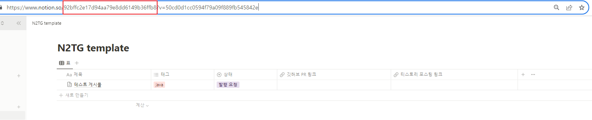

# N2TG
노션 게시글을 이용해 티스토리 블로그에 게시글을 작성하고, 깃허브 레파지토리에 커밋 후 Pull Request를 생성하는 프로젝트
  

## 📎 목차
  - [프로젝트 개요](#-프로젝트-개요)
  - [프로세스](#-프로세스)
  - [설치 및 실행 가이드 문서](#-설치-및-실행-가이드-문서)
  - [사용 기술](#-사용-기술)
  - [버그](#-발생할-수-있는-버그)
  - [다운로드](#-다운로드-링크)
  

## 📜 프로젝트 개요
- 노션에서 작성한 게시글을 깃허브와 티스토리 블로그에서 동시에 관리하기 위해 시작하였습니다.
- 매일 공부한 기록을 남기는 TIL용으로 개발하였습니다.
- 일렉트론을 이용해 윈도우와 맥에서 UI를 이용해 간편하게 이용이 가능하게 하였습니다.
  

## 🔃 프로세스
- 노션 API키, 깃허브 API키, 티스토리 API키를 검증합니다.
- 검증 후 상황에 맞게 깃허브 or 티스토리, 혹은 둘다 이용할 수 있습니다.
- 노션 게시글을 API를 이용해 불러오고, 불러온 게시글을 마크다운과 html로 변환하여, 깃허브와 티스토리 API를 이용해 각각, PR을 생성하고, 게시글을 업로드합니다.
  

## 📙 설치 및 실행 가이드 문서
1. 사전설정
    1. 노션 사전 설정
        1. 노션 API키 발급받기
            - [노션 API키 발급 페이지](https://www.notion.so/my-integrations) 로 접속합니다.
            - "새 API 통합 만들기"를 클릭합니다.
            .png)  
            - 본인의 워크스페이스를 선택하고, 사용할 이름을 기재한 후 "제출"버튼을 클릭합니다.
            .png)  
            - "표시" 버튼을 클릭하여 API 키를 확인하고, 복사 및 기록해놓습니다. 
            .png) 
            ※외부에 유출되지 않게 조심해야 합니다.  
        2. 노션 템플릿 복제하기
            - 본 프로그램은 특정 템플릿 기준으로 동작합니다.
            - [노션 템플릿 복제 페이지](https://abounding-clownfish-456.notion.site/92bffc2e17d94aa79e8dd6149b36ffb8?v=50cd0d1cc0594f79a09f889fb545842e&pvs=4) 로 접속하여 템플릿을 복제합니다.
            .png)
            - 데이터베이스 내의 설명은 하단의 실행 방법에 작성되어있으니 설정 파트에서 설명하지 않겠습니다.
        3. 노션 데이터베이스 아이디 확인하기
            - 복제한 워크스페이스에서 데이터베이스 아이디를 확인하여야합니다.
            - 복제한 워크스페이스의 링크에서 notion.so/ 뒤 부터 ? 이전까지의 일련 번호가 데이터베이스의 아이디 입니다. 아래 url 기준 (`https://www.notion.so/92bffc2e17d94aa79e8dd6149b36ffb8?v=50cd0d1cc0594f79a09f889fb545842e`) "`92bffc2e17d94aa79e8dd6149b36ffb8`" 가 데이터베이스 아이디 입니다.
            
            - 해당 데이터베이스 아이디를, 복사 및 기록해놓습니다.  
        4. 노션 게시 설정
            - 복제된 템플릿은 html으로 파싱하기 위해 게시가 되어있어야 합니다.
            - "공유" 탭에서 "게시"탭 안의 "웹에 게시" 버튼을 클릭합니다.
            .png)  
            - 게시가 완료된 화면
            .png)  
        5. 노션 API 키 연결
            - 발급받은 API키를 노션 데이터베이스와 연결하는 과정을 설명합니다.
            - "설정"탭에서 "연결 추가" 탭 안에서 API키 발급시 입력하였던 이름을 찾아 클릭하여 연결합니다.
            .png)  
            - 연결이 완료된 화면
            .png)  
    2. 깃허브 사전 설정
        1. 깃허브 API키 발급받기
            - [깃허브 API키 발급 페이지](https://github.com/settings/tokens) 로 접속합니다.
            - "FIne-Grained tokens" 탭 클릭 후 "Generate new token" 버튼을 클릭합니다.
            .png)  
            - 본인이 사용할 API키 이름과, API키 만료일, 설명, 소유자를 입력합니다.
            .png)  
            - 특정 레파지토리 혹은 모든 레파지토리 사용 권한을 설정합니다.(여기선 모든 레파지토리 권한을 부여하였습니다.)
            .png)  
            - API키에 권한을 부여합니다(커밋, PR, 브랜치생성 등)
            - "Repository permissions" 탭을 클릭해 collapse 메뉴를 표출합니다.
            - "Commit statuses", "Contents", "Pull requests" 속성에 "Read and write" 권한을 부여합니다.
            .png)  
            - API키에 계정 권한을 부여합니다(로그인)
            - "Account permissions" 탭을 클릭해 collapse 메뉴를 표출합니다.
            - "Git SSH keys" 속성에 "Read and write" 권한을 부여합니다.
            .png)  
            - "Generate token" 버튼을 클릭하여 API키를 생성합니다.
            .png)  
            - 생성된 API 키를 복사합니다. 깃허브 API키는 생성 후 단 한번만 확인할 수 있기에 복사 및 기록해놓습니다.
            .png)  
        2. 깃허브 소유자확인
            - 사용자 본인 깃허브 소유자를 확인합니다. 깃허브 프로필에 접속하여 URL을 확인합니다. 아래 url 기준 (`https://github.com/kimbongjune`) "`kimbongjune`" 이 소유자 입니다.
            .png)  
        3. 기존 레파지토리 혹은 새로운 레파지토리 생성 및 확인
            - 기존 레파지토리 혹은 새로 생성 레파지토리 생성 후 레파지토리 이름을 확인합니다.
            .png) 
            - ※주의사항 : 디폴트 브랜치(메인)의 이름은 "main"이여야 정상동작합니다.  

    3. 티스토리 사전 설정
        1. API키 발급받기
            - [티스토리 API 키 발급 페이지](https://www.tistory.com/guide/api/manage/register) 로 접속합니다.
            - API키를 발급받기 위해 약관동의, API키 이름과 설명을 입력 후 서비스URL과 CallBack은 본인 블로그 주소를 작성합니다. "등록" 버튼을 클릭해 API키를 생성합니다.
            .png)  
            - 발급된 App ID와 Secret Key를 복사 및 기록해놓습니다.
            .png) 
            ※외부에 유출되지 않게 조심해야 합니다.  

2. 실행 및 설명
    1. 설치
        - 사용자의 OS 환경에 맞게 설치파일을 다운로드 및 설치합니다.
        - ※맥 OS의 경우 보안 및 개인정보 탭에서 앱을 허용하여야 사용이 가능합니다.
        - [다운로드 링크](https://github.com/kimbongjune/N2TG/releases/tag/N2GT_1.0.0) 
        .png) 
        - 자동으로 설치 후 실행됩니다.  
    2. 검증
        1. 노션 API 검증
            - 게시글 작성 및 깃허브 PR 생성 전 노션 API키와 데이터베이스를 검증하는 단계입니다.
            - "노션 API키" 입력창에 1-1-1에서 발급받은 API키를 입력합니다.
            - "노션 데이터베이스 ID" 입력창에 1-1-3에서 확인한 데이터베이스 아이디를 입력합니다.
            .png) 
            - 입력이 완료되었다면 "노션 API 검증" 버튼을 클릭해 검증합니다.  
            - 성공화면
            .png)  
            - 실패화면. 에러 문구는 추후 업데이트를 통해 개선할 예정입니다.
            .png)  
        2. 깃허브 API 검증
            - 깃허브 PR 생성 전 깃허브 API키와, 소유자, 레파지토리 이름을 검증하는 단계입니다.
            - 깃허브 사용 체크박스를 체크하여 콜랩스 메뉴를 펼칩니다.
            - "깃허브 API키" 입력창에 1-2-1에서 확인한 깃허브 API키를 입력합니다.
            - "레파지토리 소유자" 입력창에 1-2-2에서 확인한 소유자를 입력합니다.
            - "커밋 할 레파지토리" 입력창에 1-2-3에서 확인한 사용 할 레파지토리를 입력합니다.
            .png) 
            - 입력이 완료되었다면 "깃허브 API 검증" 버튼을 클릭해 검증합니다.    
            - 성공화면
            .png)  
            - 실패화면
            .png)  
        3. 티스토리 API 검증
            - 게시글 작성 전 티스토리 앱아이디와, 시크릿키, 블로그 이름을 검증하고, 게시글의 카테고리를 조회하는 단계입니다.
            - 티스토리 사용 체크박스를 체크하여 콜랩스 메뉴를 펼칩니다.
            - "티스토리 앱 아이디" 입력창에 1-3-1에서 확인한 앱아이디를 입력합니다.
            - "티스토리 Secret Key" 입력창에 1-3-1에서 확인한 시크릿키를 입력합니다.
            - "티스토리 블로그이름" 입력창에 API키를 발급받은 계정의 블로그 이름을 입력합니다.
            .png) 
            - 입력이 완료되었다면 "티스토리 API 검증 및 카테고리 갱신" 버튼을 클릭해 검증합니다. 
            - ※블로그이름 맨 뒤에는 "/" 문자열이 포함되어 있어야합니다.  
            - 카카오 계정 로그인이 필요하므로 팝업창에서 카카오 로그인을 진행합니다.
            .png) 
            - 간헐적으로 티스토리 메인페이지로 이동하는 버그가 있습니다. 그럴 경우 해당 페이지를 닫고 다시 "티스토리 API 검증 및 카테고리 갱신" 버튼을 클릭하여 진행하면 자동으로 검증을 진행 후 페이지가 닫히게 됩니다.  
            - 성공화면. 성공시 카테고리도 같이 갱신됩니다.
            .png)  
            - 실패화면
            .png)  
    3. 노션 템플릿 설명
        - 복제한 노션 템플릿은 "제목", "태그", "상태", "깃허브 PR 링크", "티스토리 포스팅 링크" 로 이루어져있으며 하나씩 설명을 진행합니다.
        - 제목
            - 제목의 텍스트가 티스토리 게시글의 제목, 깃허브 md파일 이름이 됩니다.
            - 깃허브의 경우 md파일은 연-월-일_제목 형태입니다. ex : 2023-08-25_AWS Certification Cloud Practitioner(2).md
            - 제목 내 하위페이지가 티스토리 게시글 본문, 깃허브 md파일 본문이 됩니다.
            - 커버이미지가 있는경우 티스토리 게시글의 썸네일이 됩니다. 공식적인 API가 제공되지 않아 간헐적으로 동작하지 않는 버그가 있습니다.
            .png)  
        - 태그
            - 태그의 경우 티스토리 게시글 작성시 게시글의 태그가 됩니다.
            - 공식적으로 티스토리가 지원하는 태그의 개수까지 여러개 기재할 수 있습니다.
            .png) 
            .png)  
        - 상태
            - 상태는 "발행 요청", "오류", "발행 완료" 3개만 인식이 가능합니다.
            - "발행 요청" 혹은 "오류" 상태의 게시글만 게시글 작성시 작성이 진행됩니다.
            - 무분별한 작성 및 트래픽을 방지하기 위해 여러개가 존재하여도 가장 최근의 게시글 하나만 발행하게 됩니다.
            - 게시글 발행이 완료되면 자동으로 "발행 완료" 상태로 변경되게 됩니다.
            .png)  
        - 깃허브 PR 링크
            - 깃허브 사용 체크를 한 상태로 정상적으로 동작이 완료되어 Pull Request 가 생성되면 자동으로 Pull Request 링크로 업데이트 됩니다.
        - 티스토리 포스팅 링크
            - 티스토리 사용 체크를 한 상태로 정상적으로 동작이 완료되어 게시글 작성이 생성되면 자동으로 게시글 링크로 업데이트 됩니다.  
    4. 프로그램 사용 설명
        - 테스트 게시글을 작성하는 예시를 설명합니다.
        - 검증이 완료되었다는 가정 하에 진행합니다.
        - 현재 노션템플릿 안에 존재하는 테스트 게시물을 이용합니다.
        - 깃허브와 티스토리 둘 다 사용하는 테스트를 진행합니다.  
        - "게시글 작성" 버튼을 클릭하여 글을 발행합니다.
        .png)  
        - 진행 과정은 화면의 프로그래스바에서 확인이 가능합니다.
        .png) 
        .png) 
        - 게시글 발행이 완료되면 팝업이 뜨고, PR링크와, 티스토리 게시글 링크가 표시됩니다.
        .png)  
        - 발행 완료 후 노션 데이터베이스를 확인해보면 "상태"가 변경되었고, 각각 링크가 추가된 것을 확인할 수 있습니다.
        .png)  
        - 발행 완료 후 깃허브 레파지토리를 확인해보면 Pull Request가 생성된 것을 확인할 수 있습니다.
        .png) 
        .png) 
        .png)  
        - 발행 완료 후 티스토리 블로그를 확인해보면 게시글이 생성된 것을 확인할 수 있습니다.
        .png) 
        .png)  

        
## 🛠 사용 기술
- [nodejs 18.16.1](https://github.com/nodejs/node/tree/v18.16.1)
  - MIT License
  - [라이선스 정보](https://github.com/nodejs/node/blob/master/LICENSE)
- [@notionhq/client 2.2.11](https://github.com/makenotion/notion-sdk-js/tree/v2.2.11)
  - MIT License
  - [라이선스 정보](https://github.com/makenotion/notion-sdk-js/blob/v2.2.11/LICENSE)
- [axios 1.4.0](https://github.com/axios/axios/tree/v1.4.0)
  - MIT License
  - [라이선스 정보](https://github.com/axios/axios/blob/main/LICENSE)
- [electron 26.0.0](https://github.com/electron/electron/tree/v26.0.0)
  - MIT License
  - [라이선스 정보](https://github.com/electron/electron/blob/main/LICENSE)
- [electron-store 8.1.0](https://github.com/sindresorhus/electron-store/tree/v8.1.0)
  - MIT License
  - [라이선스 정보](https://github.com/sindresorhus/electron-store/blob/main/license)
- [electron-builder 24.6.3](https://github.com/electron-userland/electron-builder/tree/v24.6.3)
  - MIT License
  - [라이선스 정보](https://github.com/electron-userland/electron-builder/blob/master/LICENSE)
- [form-data 4.0.0](https://github.com/form-data/form-data/tree/v4.0.0)
  - MIT License
  - [라이선스 정보](https://github.com/form-data/form-data/blob/master/License)
- [jsdom 22.1.0](https://github.com/jsdom/jsdom/tree/22.1.0)
  - MIT License
  - [라이선스 정보](https://github.com/jsdom/jsdom/blob/master/LICENSE.txt)
- [notion-private-page-to-html 1.0.1](https://github.com/RFG-G/notion-private-page-to-html)
  - MIT License
  - [라이선스 정보](https://github.com/RFG-G/notion-private-page-to-html/blob/main/LICENSE)
- [notion-to-md 3.1.1](https://github.com/souvikinator/notion-to-md/tree/v3.1.1)
  - MIT License
  - [라이선스 정보](https://github.com/souvikinator/notion-to-md/blob/master/LICENSE)
- [bootstrap 5.3.1](https://github.com/twbs/bootstrap/tree/v5.3.1)
  - MIT License
  - [라이선스 정보](https://github.com/twbs/bootstrap/blob/main/LICENSE)
  

## 🐞 발생할 수 있는 버그
- 티스토리 게시글 작성 시 썸네일이 정상적으로 표시되지 않을 수 있습니다.
- 티스토리 게시글 작성 시 CSS를 포함하여 작성하며, 작성 완료 후 게시글 수정시 일부 html 엘리먼트와 CSS가 사라질 수 있습니다.
- 본인은 자바 개발자로, 자바스크립트에 익숙하지 않기에 에러처리가 미흡하여 알 수 없는 버그가 발생할 수 있습니다.
- 하위페이지 내의 또다른 페이지, 북마크 등 일부 기능은 html로 변환되지 않습니다.
- 썸네일에 대한 공식적인 API제공이 존재하지 않아. 간헐적으로 썸네일 지정이 되지 않습니다.
  

## 🔗 다운로드 링크
[다운로드](https://github.com/kimbongjune/N2TG/releases/tag/N2GT_1.0.0)
